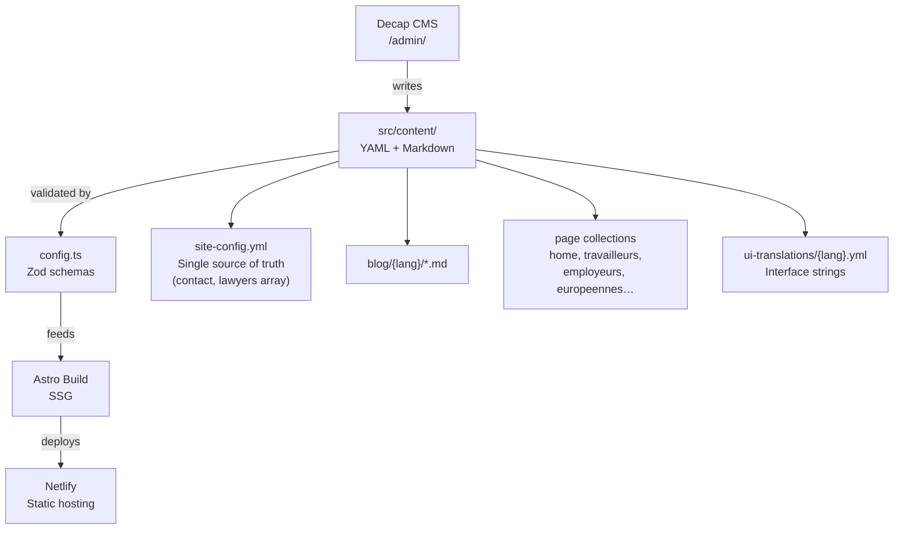

# Rizzo & Michiels — Labor Law Attorneys

Professional website for Christine Rizzo and Stephanie Michiels, labor law attorneys based in Brussels. The site serves as an information platform, expertise showcase, and primary contact point for clients.

**Stack:** Astro 5 SSG · Tailwind CSS · Decap CMS · Netlify
**Languages:** French (default) · English · Italian
**Live admin:** `/admin/` (Decap CMS, Git Gateway)

---

## Content Architecture

All content is managed through YAML files and Markdown. There is no database.



**Key constraint:** contact information (email, phone, Cal.com links) lives exclusively in `src/content/config/site-config.yml` and propagates site-wide. Never hardcode it in components.

---

## Multilingual Routing

| URL pattern | Language | Notes |
| --- | --- | --- |
| `/fr/*` | French | Default language |
| `/en/*` | English | |
| `/it/*` | Italian | |
| `/` | — | Redirects to `/fr/` via `netlify.toml` |

Invalid language params are redirected to `/fr/`. All routes use `getStaticPaths()` with trailing slashes enforced.

---

## Quick Start

```bash
npm install
npm run dev       # http://localhost:4321
npm run build     # type-check + production build
npm run preview   # preview dist/ locally
```

---

## Common Tasks

### Update contact information or lawyer details

Edit `src/content/config/site-config.yml`. The `lawyers` array drives the CTA component — add, remove, or update entries there. Each entry accepts `name`, `email`, `phone`, and an optional `calendarLink` (Cal.com URL).

### Add a blog article

Create a Markdown file at `src/content/blog/{lang}/{slug}.md` with the required frontmatter. It will appear in listings automatically.

### Add a new page

1. Create `src/pages/[...lang]/[pagename].astro`
2. Implement `getStaticPaths()` for the three language codes
3. Load translations with `getUiTranslations(currentLang)`
4. Add a content collection in `src/content/config.ts` if the page has managed content

### Modify navigation

Edit `src/content/navigation/site-navigation.yml`.

### Run SEO validation

```bash
./scripts/run-seo-tests.sh        # meta tags and structure
./scripts/run-bot-tests.sh        # crawler behavior
./scripts/run-migration-tests.sh  # 301 redirects, canonicals, sitemap
./scripts/submit_indexnow.sh      # submit URLs via IndexNow
```

---

## Project Constraints

| Constraint | Detail |
| --- | --- |
| No TypeScript | JavaScript only; `astro check` runs type inference via JSDoc |
| Static output only | SSG, no SSR or serverless functions |
| Content-first | All page content in YAML/Markdown, not in component files |
| No hardcoded contact data | Always use `getContactInfo()` from `src/utils/contact-info.js` |

---

## Deployment

Deployed on Netlify via automatic Git push to `main`. Build command: `astro check && astro build`. Output: `dist/`.

Redirects and cache headers are configured in `netlify.toml`. The CMS branch target is set on line 3 of `public/admin/config.yml` — it must point to `main` in production.

**Known pitfall — cross-domain 301 redirects:** Netlify's automatic alias redirect does not fire when the primary domain uses external DNS (e.g. an Infomaniak A record) instead of Netlify DNS. Use explicit rules in `netlify.toml` with full source URLs (`https://old-domain.com/*`) placed before all other redirect rules.

---

## Troubleshooting

| Symptom | Where to look |
| --- | --- |
| Build fails with schema error | `src/content/config.ts` — Zod schema validation is strict |
| SEO tags incorrect | `src/layouts/BaseLayout.astro` — tags are managed manually |
| Language picker broken after navigation | Ensure the picker script initialises on `astro:page-load`, not `DOMContentLoaded` |
| Contact form not submitting | `<form>` must have `data-netlify="true"` and a `name` attribute for Netlify to detect it at build time |
| CMS edits not visible in preview | Check `public/admin/config.yml` line 3 — the branch must match the branch you are previewing |

For past incidents and root cause analyses, see `maintenance/troubleshoot.md`.

---

## Contact

**Guillaume Gustin** — design and development
[hello@pwablo.be](mailto:hello@pwablo.be) · [pwablo.be](https://pwablo.be)
